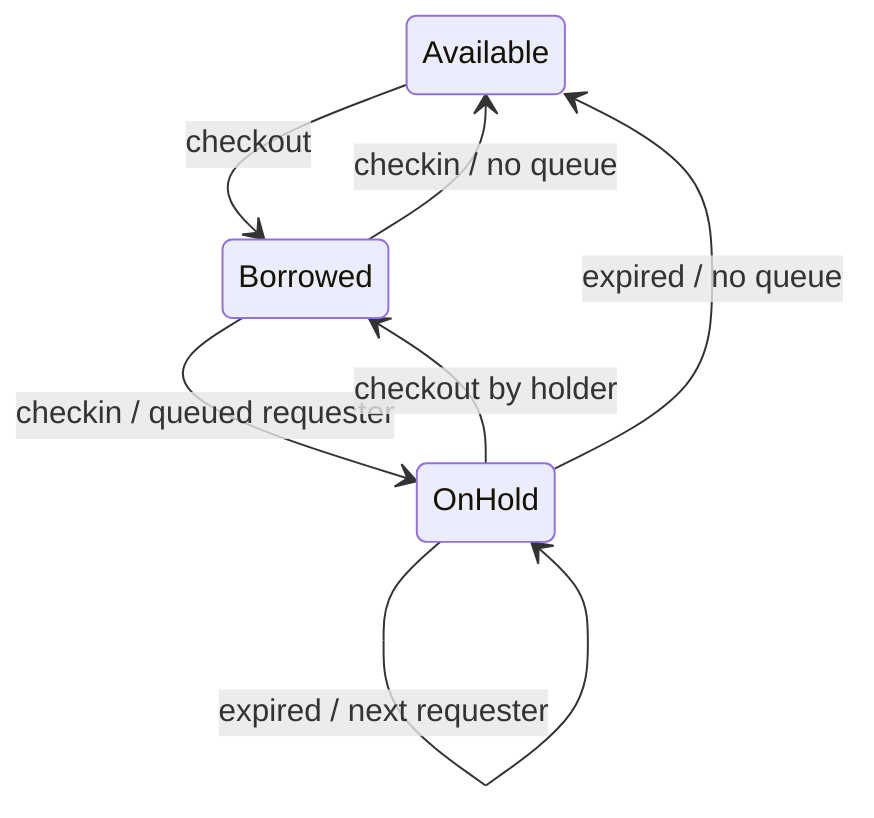

# Club Item Management System

A Java console application for managing club members, item loans and reservation queues through text commands. Members can borrow available items, request unavailable items and collect holds when returned items reach the front of their reservation queue. Date changes expire holds and transfer them to the next requester.

The implementation uses the State pattern for item behavior, the Command pattern for undo/redo, and singleton access to the club and current date. Custom checked exceptions report input and business-rule errors without stopping later commands. Commands are read from UTF-8 files, and data is stored in memory using the Java standard library. Included examples and regression tests exercise the operations and state restoration.
## Features

- Register members and add items.
- Borrow, return and collect held items.
- Maintain FIFO reservations with borrowing and request limits.
- Advance the date and transfer expired holds to the next requester.
- Undo and redo changes while restoring item states, queues and member counts.
- Read UTF-8 command files and report business errors without stopping later commands.

## Implementation

| Part | Design |
| --- | --- |
| `Club`, `Member`, `Item` | Encapsulated models and member/item relationships |
| `ItemStatus` implementations | State pattern for Available, Borrowed and On Hold behavior |
| `RecordedCommand`, `Cmd*.java` | Command pattern with undo/redo history |
| `Club`, `SystemDate` | Singleton access to the club and current date |
| `ExClub`, `Ex*.java` | Checked exceptions for invalid commands and business rules |
| `Main` | File I/O with `Scanner`, UTF-8 and try-with-resources |
| `Day` | Strict date parsing and calendar arithmetic |



Each member may borrow up to six items and hold up to three queued requests. A returned item goes to the first requester when a queue exists. A hold lasts through its expiry date and transfers on the following day. Only successful changes enter the undo history; a new change clears redo history.

[Command and design notes](docs/usage.md) explain all operations, date rules, state restoration and earlier fixes. A useful reading order is `Main`, the models, the state classes, `RecordedCommand`, then `CmdCheckin` and `CmdStartNewDay`.

## Getting started

Requires JDK 8 or newer with `java` and `javac` available. Run from the repository root.

Windows PowerShell:

```powershell
New-Item -ItemType Directory -Path build -Force | Out-Null
javac -encoding UTF-8 -d build (Get-ChildItem src -Filter '*.java').FullName
java -cp build Main data/sample_commands.txt
```

macOS/Linux:

```bash
mkdir -p build
javac -encoding UTF-8 -d build src/*.java
java -cp build Main data/sample_commands.txt
```

Without a command-line filename, the original interactive entry point prompts for one:

```text
java -cp build Main
Please input the file pathname: data/sample_commands.txt
```

Quote paths containing spaces on the command line; enter the path itself at the interactive prompt. The first nonblank command in the file must set the initial date, for example `startNewDay 03-Jan-2026`. Commands and IDs are case-sensitive; names are single tokens such as `Java_Book`.

## Example

The included [command file](data/sample_commands.txt) exercises registration, loans, reservations, cancellation, returns, hold collection, date changes and undo/redo. Its [reference output](data/sample_output.txt) ends with both items Available and all borrowing and queued-request counts at zero.

## Testing

The existing PowerShell script compiles the project, runs the regression suite and compares the sample output:

```powershell
.\scripts\verify.ps1
# If needed, select a JDK explicitly:
.\scripts\verify.ps1 -JavaHome 'C:\path\to\jdk'
```

Manual test commands:

```bash
mkdir -p build
javac -encoding UTF-8 -Xlint:all -d build src/*.java tests/*.java
java -cp build RegressionTests
```

On PowerShell, compile with:

```powershell
javac -encoding UTF-8 -Xlint:all -d build (Get-ChildItem src,tests -Filter '*.java').FullName
java -cp build RegressionTests
```

Tests need no JUnit. Eight scenario groups run in separate JVMs to isolate singleton state and history; CLI tests use timeouts. Earlier checks passed on JDK 24.0.2 without source warnings, including a `javac --release 8` compatibility check. An actual Java 8 JVM was not tested. The existing verification script also passed earlier in this submission-preparation session: all eight scenarios passed and sample output matched the reference. Runtime tests and the Java 8 compatibility compile were not rerun for this V2 documentation-only pass.

## Project layout

```text
src/       Models, commands, states, date handling and exceptions
data/     Sample command file and reference output
tests/    RegressionTests.java
scripts/  PowerShell verification script
docs/     Command and design notes
```

The source uses the default package and separate Java classes. Build output goes to the ignored `build/` directory.

## Academic context and contributions

This project originated in Java OOP coursework. The repository retains the course design with later input-validation and undo/redo consistency fixes. The available materials do not establish whether the original work was individual or collaborative, so no exclusive personal authorship is claimed.

## Limitations

This is a single-threaded console system. Data and history are lost on exit; there is no database, GUI or online service. Names cannot contain spaces. No license is supplied pending confirmation of the coursework's reuse permissions.
